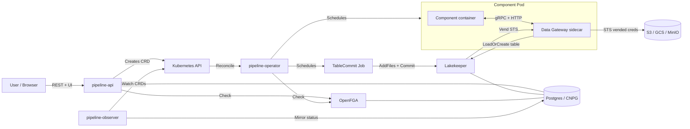

# Architecture

Datuplet is a K8s-native streaming ETL platform. Pipeline components run as
ordinary containers; a Data Gateway sidecar handles all storage I/O. Apache
Iceberg is the table format; Lakekeeper is the catalog. No component ever holds
long-lived cloud credentials — Lakekeeper vends short-lived STS tokens per run.

---

## System overview

---

## Components

### pipeline-api

HTTP control plane and browser UI. Defaults to 2 replicas (stateless; DB writes
go through the observer).

Responsibilities:

- User login via session cookie (HttpOnly, 24 h sliding).
- Project + pipeline + run CRUD. Per-project FGA authorization on every write and read.
- Run trigger: mints a per-run RS256 JWT (`token_kind=run`, audience
  `datuplet-catalog`, 24 h) and creates the PipelineRun CRD + run-token Secret.
- OIDC discovery (`/.well-known/openid-configuration`) and JWKS publication.
  Lakekeeper polls this to validate run-token JWTs.
- Storage browse proxy at `/api/v1/storage/*` — forwards requests to Lakekeeper
  with a short-lived (5 min) impersonation JWT.
- Browser SPA at `/ui/*` (vanilla ES modules, no build step).

### pipeline-observer

Single-replica K8s informer. Watches PipelineRun CRDs and mirrors their status into
the Postgres `runs` table. Kept at 1 replica intentionally — multiple writers on the
status mirror cause data races. If the observer Pod is down, UI run-status rows go
stale until it recovers; actual pipeline execution is unaffected.

Metrics (`:8081/metrics`): `pipelineapi_observer_lag_seconds`,
`pipelineapi_db_updates_total`, `pipelineapi_informer_cache_size`.

### pipeline-operator

controller-runtime reconciler. Watches PipelineRun CRDs and drives the execution
lifecycle:

1. Creates per-stage component Pods (one Pod per component per stage).
2. Injects the Data Gateway sidecar + run-token Secret into every Pod.
3. On stage completion, schedules a TableCommit Job per output table.
4. Propagates cancellation via pod annotation `datuplet.io/cancel=true`.

### Data Gateway sidecar

Runs alongside every component container in the same Pod. The component never
touches S3 directly; it talks to the gateway over gRPC (port 50051, control) and
HTTP (port 50052, data).

Responsibilities at boot:
- Reads the run-token JWT from `/var/run/secrets/datuplet-runtoken/token`.
- Validates the JWT against pipeline-api's JWKS (RS256 signature, expiry, claims).
- Resolves the warehouse from the JWT `warehouse` claim.

Responsibilities per write:
- Calls Lakekeeper `LoadOrCreate` to get (or create) the table and STS credentials.
- Buffers incoming data (up to 128 MB per file), converts to Parquet, writes via
  STS-vended S3 credentials.
- Writes a `files.json` manifest at
  `<table-base>/.run-state/<run-id>/files.json` listing the written parquet paths.

Responsibilities per read:
- Fetches the current Iceberg snapshot from Lakekeeper.
- Streams parquet row-groups to the component in the requested format (Parquet,
  Arrow IPC, CSV, JSON).

### TableCommit Job

A short-lived Job scheduled by the operator after each pipeline stage. One Job per
output table.

Reads the `files.json` manifest left by the Data Gateway, opens an Iceberg
transaction at Lakekeeper, calls `txn.AddFiles` (APPEND) or
`txn.ReplaceDataFiles` (FULL_LOAD), and commits. Retries on 409 conflict up to 5
times with exponential backoff.

### Lakekeeper

Iceberg REST catalog. The single source of truth for table schemas, snapshots, and
warehouse credentials. Stores state in its own logical Postgres database on the
shared CNPG cluster.

- Holds the warehouse credentials (S3 key / GCS SA key) passed at bootstrap time.
- Vends short-lived STS credentials scoped to each run's token (≤15 min lifetime,
  renewed at 50% elapsed by the Data Gateway).
- Validates run-token JWTs (RS256, issued by pipeline-api's JWKS) on every catalog
  API call.
- Enforces per-project FGA authorization via OpenFGA.

### OpenFGA

Fine-grained authorization store. Every pipeline-api write and every Lakekeeper
catalog call checks FGA. The primary grant is `(user:oidc~<uuid>, data_admin,
project:<lakekeeper-project-id>)`. Synthetic run identities (`user:oidc~<run-uuid>`)
receive an `editor` grant at trigger time and lose it when the run is cancelled
(tuple deletion).

### CNPG (Postgres)

CloudNativePG cluster provisioned in Phase 2. Three logical databases:
`pipeline-api` (runs, projects, users, sessions), `openfga`, `lakekeeper`. One
Cluster, separate users, no cross-DB access.

---

## Data flow

A complete pipeline run from trigger to committed Iceberg table:

1. **Trigger.** User POSTs to `/api/v1/projects/{P}/runs`. pipeline-api checks FGA
   (`data_admin` on project), mints a run-token JWT (RS256, 24 h), writes FGA tuple
   `(user:oidc~<run-uuid>, editor, project:<lkP>)`, creates the PipelineRun CRD
   and a run-token K8s Secret.

2. **Schedule.** pipeline-operator reconciles the PipelineRun; creates component
   Pods with the DG sidecar and the run-token Secret projected at
   `/var/run/secrets/datuplet-runtoken/token`.

3. **Boot.** DG sidecar validates the JWT against pipeline-api's JWKS, parses
   `warehouse` and `project_id` claims, and waits for the component to connect via
   gRPC.

4. **Write.** Component calls `OpenWriter` → DG calls Lakekeeper `LoadOrCreate`
   table, receives STS credentials, writes parquet to S3/GCS. DG accumulates
   chunks into 128 MB parquet files.

5. **Finalize.** Component calls `Commit` → DG writes `files.json` manifest per
   table inside the table's Iceberg-managed prefix.

6. **Commit.** Operator schedules a TableCommit Job per output table. Job reads
   `files.json`, opens an iceberg-go transaction against Lakekeeper, `AddFiles` /
   `ReplaceDataFiles`, commits.

7. **Cancel.** If the run is cancelled, pipeline-api deletes the FGA tuple (blast
   radius: next STS renewal after ≤15 s will fail). Operator sets
   `datuplet.io/cancel=true` on all component Pods; DG polls the annotation and
   calls `GracefulStop`.

---

## Auth flow

Four token types in descending lifetime:

| Token | Who holds it | Lifetime | Purpose |
|---|---|---|---|
| Session cookie | Browser / API client | 24 h sliding | Authenticate to pipeline-api |
| Run-token JWT | DG sidecar + TableCommit Job | 24 h | Authenticate to Lakekeeper catalog |
| Impersonation JWT | pipeline-api storage proxy | 5 min | Interactive storage browse |
| STS credential | DG sidecar (in-memory) | ≤15 min | S3 / GCS object writes |

For the full token lifecycle, see [docs/auth-flow.md](auth-flow.md).

---

## Storage abstraction

Lakekeeper owns all long-lived warehouse credentials (S3 access key / GCS service
account key). These are passed as flags to `pipeline-api admin lakekeeper-bootstrap`
at install time and forwarded to Lakekeeper; pipeline-api keeps no record. No
Datuplet Deployment (pipeline-api, observer, operator) mounts a warehouse
credential at runtime.

Every runtime S3 operation uses STS-vended credentials (AWS STS or Google
impersonated tokens) scoped to the requesting run's token. The Data Gateway renews
credentials at 50% of their issued TTL, with a 60 s minimum renewal interval. On
cancellation, FGA tuple deletion prevents renewal; the credential expires within the
STS TTL (≤15 min).

Storage paths are opaque strings throughout the system. Lakekeeper allocates
UUID-keyed paths (`s3://<warehouse>/<storage-uuid>/<table-uuid>/`); the Data
Gateway passes these verbatim. Only Lakekeeper interprets them.

---

## What this is good for

- Experimental streaming ETL pipelines writing to Apache Iceberg on K8s.
- Multi-tenant projects with strong tenant isolation (per-project FGA, per-run
  STS credentials, separate K8s namespaces).
- Greenfield setups where you want a K8s-native control plane with a browser UI,
  without running a full Airflow or Prefect cluster.
- Component development using thin Go or Python SDKs without direct S3 access.

## What this is not good for (v0.1)

- Production-critical workloads. This is a 0.x release; APIs and CRD shapes
  will change between minor versions.
- Pipelines requiring sub-second SLAs. Pod scheduling + DG sidecar boot adds
  seconds of latency per stage.
- Non-Kubernetes deployments. The four-chart Helm install is the only supported
  surface.
- EKS or AKS deployments. Only GKE is validated for v0.1.
- High-frequency incremental reads. The `sinceDays` / column-predicate filter is
  wired through the CRD but not yet honoured by the Lakekeeper read path; DG
  falls back to a full snapshot read.
